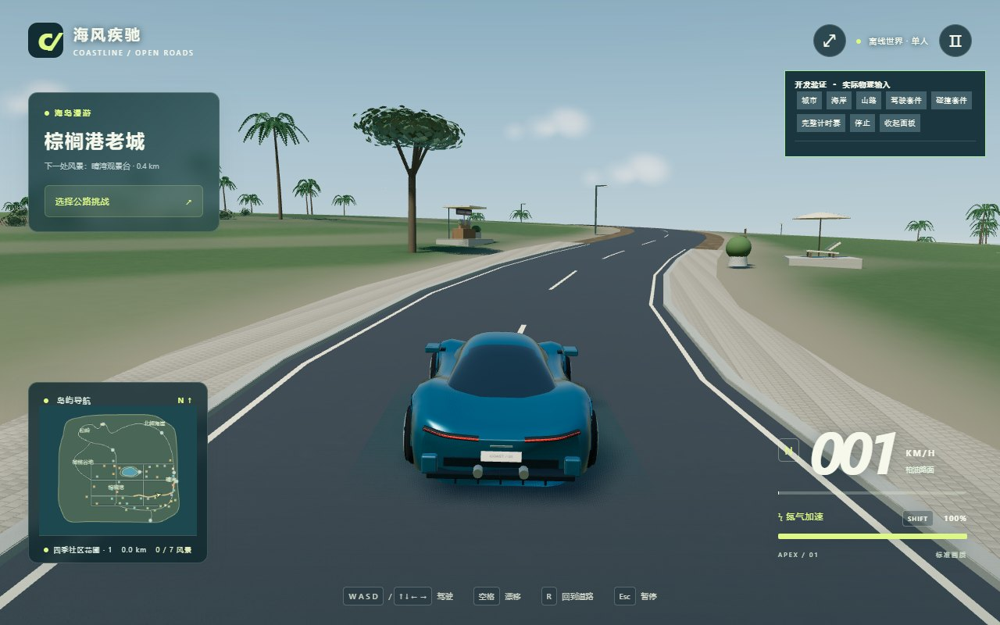

# 晴湾花园路 · 2026-09-09 制作交付

## 启动与路线

已生成本机生产目录 `dist/`。双击项目根目录的 `启动游戏.cmd`，或在根目录运行 `npm start`，浏览器打开 `http://127.0.0.1:8765`。终端 Ctrl+C 关闭临时服务器。已有 node_modules 可直接运行，无需重新安装。

在菜单选择「晴湾花园路」入口（对应 scenic-drive-button），车辆会出现在住宅街道起点。跟随迷你地图金线穿过缓弯，在海岸交叉口左转，沿海北行，右转进入晴湾观景支路。全程约 **892 米**；观景台加入现有风景发现系统。开车使用 WASD/方向键，空格手刹，Shift 氮气，R 回到道路，Esc 暂停；无限氮气仍在暂停菜单控制。

## 实际制作内容

- 原来 15 米宽的横向直街改为 8.4 米宽的曲线住宅道路；穿过原有交叉口，在海岸接入环线。环岛公路缩为 10.5 米。支路、标线、路肩、道路空间索引、轮胎地表判定、重置和迷你地图共享实际道路数据。比赛环线节点不变，护栏根据新宽度重新生成。
- 住宅—花园—海岸序列采用 8 处错落住宅布局，清理视线内旧建筑，保留内陆林带。曲线沿线花床自动随道路位置和法向布置。海岸加缓坡，观景点具有实际道路入口、步道、坐凳、细栏杆与指示牌。
- 跑车重塑前翼子板、腰线与后肩，尾部向侧面收拢。原来分片玻璃和凸出的顶边条改为连续曲面座舱、曲顶及长溜背；尾灯沿车尾包裹，保留刹车响应与车轮运动。座舱按车漆/玻璃分组，仅两个材质绘制组；停放车辆复用新轮廓。
- 住宅使用不同上层体块宽深和一类坡屋顶；坡地基础按实际地面分段做石材收口。树冠缩小叶片簇、减少几何核心、增加轮廓空隙。仍复用空间批次与既有 LOD。
- 调整统一太阳方向、直射/天空补光比例和雾密度，区分较深柏油与绿色地表；降低追尾镜头高度和基础视角，随速度适度拉开。近岸埋入式岩体与海上石灰岩小岛补充远景轮廓。外海小岛是不可驾驶的背景景物。

## 必要检查

- **生产构建一次通过**：Vite 8.2.2，60 模块。主包 727.35 kB，gzip 202.70 kB。仍有超过 650 kB 的现有大包提示，没有以调高阈值隐藏它。
- **仅一次短浏览器会话**：Chrome headless / SwiftShader，1280×800；生产版本启动，进入自由驾驶，短按 W，返回正速度与位置变化。捕获的 JavaScript/着色器错误为空。保存截图后关闭临时浏览器和服务器。
- 没跑自动驾驶、完整比赛、碰撞回归、测试矩阵或帧率基准；没有安装依赖、下载素材。
- 截图来自真实追尾镜头，使用开发观察入口定位到路线约 x=423、z=542 的坡前路段；右上角开发面板属于 `?qa=1` 页面，普通游戏链接不带此面板。画面未修图。

## 从截图看，仍然不足的地方

车身与道路曲线有了更清楚的轮廓，但这轮尚未达到成熟独立游戏的环境美术水准。草地近景仍偏平、缺少密度层次；旧版街边设施仍有矩形底座、球形盆栽和模块感。截图处于海湾展开之前，不能据此声称海湾构图已达到目标。住宅、观景点和外海小岛未在本次有限会话中逐一观察。

主车仍为原创程序曲面模型，后保险杠、后视镜、侧窗收口有进一步精修空间。海面依赖已有风格化着色器与天空反射，没有真实场景的动态反射。低画质逻辑保留，但本轮未实测性能。道路收窄、地形增加坡度后，比赛难度可能变化；已有个人纪录保留，但未做完整比赛验证。

## 构建、分发与部署

源码与本截图提交至现有 Git 仓库；`dist/` 按项目既有规则不纳入 Git，已在本机生成。换电脑后在已安装 Node.js 的环境执行 `npm ci`、`npm run build` 即可重建。

静态服务器发布 `dist/` 内全部内容，保持 `assets/` 与 `licenses/` 相对位置；不要上传 node_modules。使用仓库已有 Vite 相对路径设置，可部署在静态站点子目录。推送源码不会自动把游戏部署到服务器，本轮也未执行部署。

资源许可见根目录 `ASSET-LICENSES.md`。清理本轮临时内容可删除项目内 `.tmp/`；`dist/` 可随时删后重建。不要删除源码、public、package-lock.json 或 `.git`。
