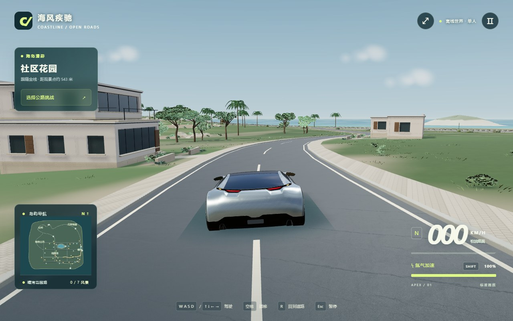

# COASTLINE · 2026-09-10 制作与交付

## 本轮完成的内容

- **树木与灌木**：主树冠改为有厚度的多层枝叶遮罩，松树与橄榄树具有不同的冠形。远景保留全部冠层范围，只简化内部层数。重做近景灌木，统一模型原点与既有摆放尺寸，修复替换模型后根部悬空的问题。住宅周围采用不等距树丛，海湾方向保留视线开口。
- **住宅与材质**：墙面从岩石航拍纹理改为约 83×42 厘米尺度的砌石纹理；灰泥减少强烈照片斑驳。侧墙增加实际窗洞、窗台与遮阳板，补齐阳台地板和侧边栏杆，保留已有三种住宅结构与实体碰撞。
- **草地与道路关系**：地形根据住宅范围形成维护草坪与自然草地的过渡；缩短草叶，降低尖刺感。种植床采用渐变边缘，改善铺装、土壤和草坪的硬切换。微小地形起伏使用共享高度函数，车辆、道路与建筑继续使用同一地面采样。
- **驾驶构图**：局部丘陵重心移至住宅后侧，让道路逐渐下降并露出海湾；保留约 892 米实际道路路线。HUD 按路线位置提示住宅、花园、海湾和观景点，并显示剩余距离。
- **保留内容**：主车与车轮动画、已有驾驶物理、三场比赛、个人纪录、无限氮气、暂停、画质、声音和存档键均保留。没有修改比赛流程，没有扩大地图。

## 必要检查的真实范围

开始时只看已有截图，没有开启浏览器。初次生产构建成功；画面检查发现旧灌木轮廓与新冠层不协调，随后又发现替换后的模型原点不匹配，分别做了针对性修复与构建。**实际共三次成功构建、一次短启动检查和两次定点复查**，没有运行自动驾驶、测试矩阵或完整比赛。

短驾驶检查确认车辆与 HDR 成功加载；加速达到约 27 km/h，转向输入使航向从约 1.1215 变为 1.2074 弧度。Esc 暂停后输入清空，继续按钮恢复驾驶。加载与驾驶检查记录中没有 JavaScript 异常或着色器错误。最后一次只保存修正贴地后的静态追尾画面，不重复驾驶流程。

截图来自真实游戏，车辆停在住宅向海湾过渡的弯道前；没有修图、替换天空或隐藏场景物件。开发 QA 面板在截图中隐藏。临时浏览器和端口 8774 的本地服务已关闭。

检查环境使用 Chrome 软件 WebGL，不能据此推断真实显卡帧率。没有重新验证全地图碰撞、三场比赛、低画质、失焦或跨浏览器兼容。构建仍提示主脚本超过已有的 650 kB 提醒阈值，最终约 766 kB；这是体积提醒，构建成功。

## 从实际截图看品质

代表路段已经能够同时呈现跑车、住宅、道路转弯、海湾与外海小岛，住宅的斑驳石材与草地尖刺感明显减少。相比上一版，视线展开和地面连接更清楚，适合作为单人公开试玩版分享。

仍有局限：树冠近看能辨认出片层，背景植被存在重复感；部分旧设施、停放车辆和外海小岛仍是简化模型。画面尚未达到全地图人工精修的水平。主车没有内饰视角、损坏系统或交通 AI。未经本轮实测的玩法与硬件表现不作通过保证。

## 启动、资源与分享

本地项目：双击根目录“启动游戏.cmd”，或 npm start。点击“出发，自由驾驶”即进入代表路线；Esc 菜单也可选择“自由漫游：晴湾花园路”。

本地交付另提供 deliverables/COASTLINE-2026-09-10.zip 生产游玩包，解压后双击其中的启动入口。启动器需要已有 Node.js；静态网站上的玩家只需电脑浏览器。完整源码保存在 GitHub 仓库，压缩包不包含开发依赖。

本轮没有下载新素材或安装依赖；枝叶遮罩、砌石纹理与几何均由项目代码生成。原有主车 CC BY 4.0、HDR 与地表 CC0 许可继续适用。发布时保留 dist/licenses，详细记录见根目录 ASSET-LICENSES.md。

生产构建在 dist，静态发布方法见 DEPLOYMENT.md。只提交并推送源码与资源，不自动部署网站。压缩包、构建、node_modules 与 .tmp 不进入源码 Git 历史；.tmp 可在关闭游戏后清理。

