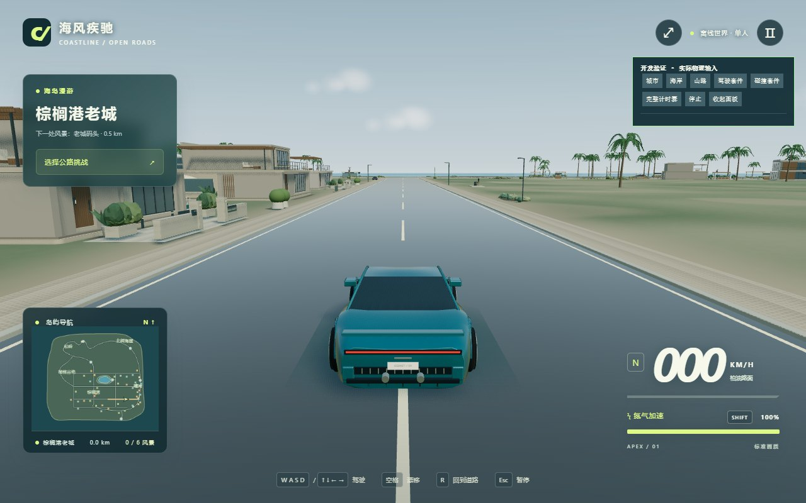

# 自然布局与晴湾花园路（2026-09-09）

## 审查后修复

- ArtMaterials 将实例矩阵直接乘以法线，在非等比缩放的模型上会给三向纹理投射提供错误方向。现在按旋转/缩放矩阵列长平方校正，再转换至世界空间，适用于项目当前不含剪切的实例变换。
- 轮胎旋转剖面连接到轴心，轮毂筒也有封闭端盖，会挡住内部刹车盘。改为空心轮胎剖面和开口轮毂筒，保留轮距、轮胎外径和物理参数。车漆减轻金属底色，玻璃调整为较中性的深灰蓝。
- 道路外所有场地共用一个完整碰撞矩形，入口看似可通过，车辆却无法进入。果园、花圃、雕塑花园移除整块平台与整块碰撞；树干、花箱、座椅、棚柱和雕塑等分别阻挡。网球场保留平整球场，用实际显示的围网和前栏杆封闭。
- 果园和公园不再重新铺满矩形草坪。步道与不规则种植床逐点采样物理高度场；种植箱采用不同长度，果树行列有小幅错位与缺口。连接步道先检查现有障碍，无法安全连通则跳过。

## 示范路线

从 (55,569.5) 沿南侧住宅街向东，到现有环岛公路后向北至约 z=414，全长 720.57 米。没有新增或改动比赛道路与检查点。

住宅段保留建筑遮挡，配置低矮种植带、短墙座凳与细比例路灯。社区过渡段保留入口识别。海湾窗口清除 5 座建筑和 15 棵遮挡树木；相关碰撞同步移除并重建索引，不留下旧碰撞。实际生成 4 组定点种植景观，原有社区新增 9 条无障碍连接步道。

在 Esc 菜单选择“自由漫游：晴湾花园路”可回到路线起点，此操作结束当前比赛。迷你地图在自由驾驶时显示金色路线。

## 材质与资源

接触暗部不透明度由 0.26 降为 0.18；微表面凹凸在 45–130 米之间渐弱，降低远处细节闪烁。种植床、步道与已有物件复用材质，并按空间和材质合批；继续沿用低画质的分辨率、远景模型和可视范围控制。

没有新增依赖、下载素材或使用收费资源。新增几何与代码为项目内制作，既有资源许可沿用 ASSET-LICENSES.md。

## 实际检查

一次生产构建成功：59 模块，主 JS 722.00 kB，gzip 200.56 kB。保留现有 650 kB 分块阈值提示。

仅一次 Chrome 短暂启动，使用软件 WebGL，定位到示范路线中段的正常追尾相机，保存一张真实截图。当前画面没有记录到 JS 异常或 WebGL 着色器错误，错误面板为空。没有运行自动驾驶、整场比赛、测试矩阵、硬件帧率测试或反复截图。截图是静止驾驶视角，不是路线全程验证；右上开发面板来自本次使用的 qa 入口，普通入口不加载它。

临时服务器及专用浏览器已关闭。

## 剩余限制

- 真实截图中的车尾轮廓仍偏方，海湾前的直线较长，大片地面仍显单调；此轮不代表达到成品美术品质。
- 只重点处理一段现有路线，其他区域仍保留重复布局、部分矩形庭院和较粗的模型；既有抬高小庭院的整体碰撞尚未全部改造。
- 社区连接通道只在现有障碍允许时生成，并非每处设施都有铺装连接。网球场仍是景观，没有体育互动。
- 车辆高度仍来自地形采样，没有专门模拟轮胎驶上路缘的悬架响应。没有验证新增场地全部接触边界、整条示范路线或完整比赛。
- 没有实时场景镜面反射，也未进行 GPU 性能量化；增加的贴地几何与实例在目标机器上的开销仍需后续按需确认。

## 运行和交付

源码与本地 dist 已更新。双击根目录“启动游戏.cmd”或运行 npm start。Git 提交源码、文档和真实截图，dist 按既有规则忽略；静态服务器部署可上传本地 dist 的全部内容。此轮按用户要求推送现有 GitHub main，不另行部署服务器。
