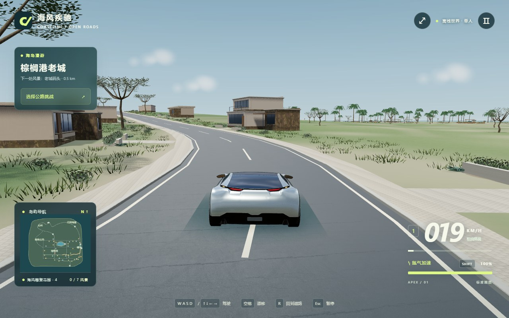

# COASTLINE 试玩候选版 · 2026-09-09

本轮基于已有的晴湾花园路与驾驶玩法制作，不扩张地图。开始时使用已有 coastal-drive-2026-09-09.jpg 审查；结束时仅开了一次短浏览器会话。没有将概念图或处理后的截图当成成果。

## 画面判断与具体改动

原图最明显的问题是主车的方块尾部与座舱、树冠的大块轮廓、孤立设施和宽浅色路边带。原有道路数据与驾驶逻辑值得保留，继续修补主车几何则收益有限。

**主车。** 改用经筛选的 Car Concept 本地 GLB，真实车身曲面和轮拱替代原来的拼接造型，车肩、后窗和尾部轮廓更连续。保留模型轮毂、轮胎、刹车盘、灯组和后视镜。制作脚本移除隐藏内饰、发动机与车轴、未使用材质变体和纹理数据，将原件从 11.78 MB 整理为 9.42 MB；约 16.85 万三角形。调整车漆、玻璃与纹理采样，移除牌照和胎侧标志贴图。不是原创设计的车型，必须按 CC BY 4.0 署名。

新增车辆适配层连接原有物理状态，前轮转向、车轮滚动、静止卡钳、刹车灯、车身反馈与氮气继续工作。旧程序车型作为加载失败的备用车型保留。GLB 内含所有纹理，运行时不下载外部车型。

**住宅。** 重做 L 形庭院住宅、错层高低翼楼、斜屋顶矮层住宅三类平面。窗洞包含墙体、窗台和凹入玻璃，屋顶边缘和门窗边框收细；坡地用分段基础贴地。碰撞由实际首层建筑体块组成，L 形院子不再用完整矩形封闭。接触暗部也对应实际体块。

**树木与景观。** 松树、橄榄树重新生成树干、主枝、细枝和小叶片，不再用实心几何团块做主树冠；共用几何与两档远景冠层。棕榈增加不同倾角的羽状叶。路线布置十二栋错落住宅，增加对应入口的铺装、短院墙、种植带与龙舌兰；移除代表路线上的通用设施底座布置，保留专门安排的花园。短草和灌木按片区聚集，入口保留通行空间。

**道路和地形。** 代表路线仍为约 892 米，保持使用实际道路数据生成迷你地图和重置位置。住宅人行道收窄，收紧宽裸土地带，减少道路下方地面压低的幅度；局部海岸丘陵重塑，服务于视野展开。地形调整在共享高度函数中实现，车辆、地形与景物共用。没有修改比赛逻辑。

**日光与界面。** 增加本地 Poly Haven 1K HDR，用预过滤环境光提供车漆与玻璃反射，保留游戏天空、统一日光和阴影。新增加载说明与资源失败提示，署名可从主菜单查看；HUD 收小。菜单保留真实场景，点击自由驾驶直接到花园路起点。加载器异步分包，不增加安装依赖。

## 必要检查结果

- 一次生产构建成功，生成 dist，完整目录约 15.72 MiB。
- 构建提示主脚本约 762 kB，超过已有的 650 kB 提醒阈值；这不是构建错误，尚未进一步压缩主渲染代码。
- 一次 Chrome / WebGL 短会话确认：车辆 GLB 与 HDR 加载成功，没有使用备用资源；起点为晴湾花园路。
- 短按油门后速度约 5.27 m/s（19 km/h）。Esc 后 mode 为 pause、输入集合清空，点击继续后 mode 为 play。
- 本次会话未记录 JavaScript 异常或 WebGL 着色器错误。
- 保存的单张截图采用真实驾驶镜头，位置在住宅路中段；未修图、未更换天空或叠加模型。
- 临时浏览器和本地服务已结束。

这次运行使用软件 WebGL 环境确认加载与画面，不能代表用户显卡的帧率或完整驾驶手感。没有跑自动驾驶、完整比赛、全地图碰撞、低画质矩阵和跨浏览器回归。保留功能不等于本轮重新实测了全部功能。

## 对截图的诚实评价

主车后肩和尾部明显摆脱此前的方块拼装感，反射能呈现曲面；道路转弯、住宅入口和沿线植被有连续关系。它已经能够作为公开分享的单人试玩候选版，帮助收集实际玩家反馈。

**还没有达到全面精修成品的环境美术水平：**

- 新树冠存在偏稀疏、枝条过于规则的问题，背景林带仍有重复感。
- 住宅石材纹理偏杂；部分侧墙大而空，远处建筑仍显简化。
- 草地的中远景仍偏平坦，草丛与大面积地面的密度过渡不够自然。
- 本次住宅路截图没有呈现海湾，因此没有以这张图证明完整的海景展开、沿海弯道和观景点构图均已达到目标。
- 旧停放车辆、部分公共设施与岩石尚未按主车的品质重做。
- 主车内饰已裁剪，深色玻璃采用简化材质；没有第一人称、车身损坏或交通车辆。

## 发布内容

源码、GLB、HDR、地表材质、署名和工具脚本均在仓库。生产构建在本地 dist；构建输出不进入源码 Git 历史，可由锁定依赖重新构建。README 面向新玩家，旧说明归档到 DEVELOPMENT-HISTORY.md。

启动：根目录“启动游戏.cmd”或 npm start。自由驾驶直接进入代表路线，Esc 中也可选择“自由漫游：晴湾花园路”。键位、设置、记录和静态发布方式分别见 README 与 DEPLOYMENT.md。

第三方素材的来源、处理过程与许可证见根目录 ASSET-LICENSES.md；打包分享时保留 dist/licenses。素材制作脚本为 scripts/prepare-car.mjs，输入原始 CarConcept GLB，输出本地修改版。游戏运行不需要原始下载缓存。

