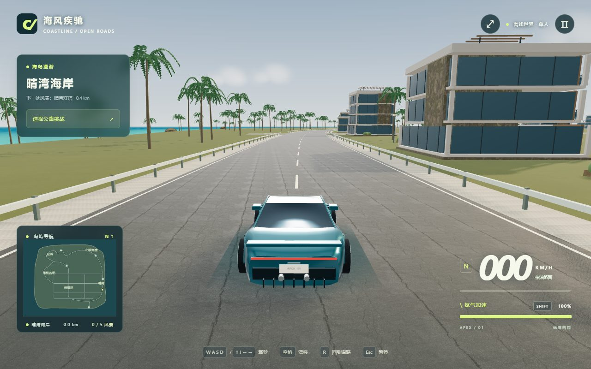
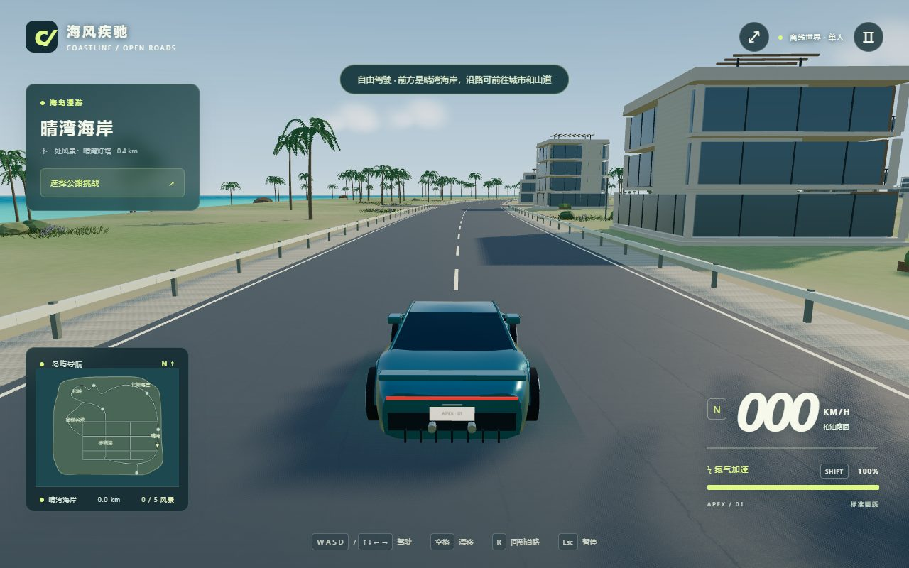

# 无限氮气与中央湖畔公园

实现：Esc 暂停菜单开关、localStorage 持久化、HUD 无限标记；无限模式清除耗尽锁定且保留 Shift/油门触发规则，关闭后恢复正常消耗。开启过无限氮气的比赛不会写入普通纪录与奖牌，本场辅助标志持续至比赛结束，重新挑战时按当前设置重置。

新增镜湖公园：约 220×180 米的不规则淡水湖，湖盆与物理高度一致，独立动态湖面，连接东侧城市道路的环湖路、木栈道、休憩座椅、三处观景亭、树丛、芦苇睡莲、中央喷泉。水滴 240 个，低画质 72 个；喷泉在标准/低画质分别超过 1200/550 米后不绘制。迷你地图显示湖岸，发现点增加为六处。普通植被和房屋生成预留湖区空间，公园树木避让道路和已登记实体。路边庭院按实际空地择址，最多 24 处。

必要检查：Node 核心检查确认无限氮气从耗尽锁定恢复、持续加速不消耗、关闭后恢复消耗、松开按键停止加速。第一次湖路边界检查发现主环线穿过最初候选湖心，将湖心移至 (-3,40)、半径调整为 (110,88)，并修正入口；针对湖盆、所有道路采样中心线和落水复位的复核通过，最小归一化岸距 1.2785。一次生产构建成功：46 个模块，主 JS 670.94 kB（gzip 182.49 kB），保留已有分块体积提示。

未运行浏览器、截图、自动驾驶、整场比赛或回归矩阵；开关的实际菜单操作和页面重载、GPU 水面/喷泉画面、最终庭院数量与帧率尚未浏览器实测。现有截图均来自更早版本。临时服务器和浏览器本轮未启动，未推送或部署。

---

# 沿路生活场景制作记录

本轮重点是驾驶路线内的内容密度和用途辨识，而非继续增加随机植被。新增六类场所：咖啡露台、冲浪租赁点、公交站、市集、补给站、观景台。候选位置围绕海岸出发路段展开，少量延伸至城镇、谷地和山顶。完整场地检查海拔、坡度、道路和已登记障碍，并在附近寻找合适位置；无适宜位置时跳过。

模型包括桌椅、杯碟、遮阳伞、自行车及轮辐、冲浪板、救生圈、候车亭和路线牌、市集台与货品、饮水/充电设施、观景望远镜、花箱与垃圾箱。港口帆船采用尖艏船体、木甲板、舱窗、护栏、缆绳和弯曲帆面。建筑增加住宅窗墙变化和开放阳台；主车改造尾部格栅、灯带底座、低扰流板、车牌比例、轮距和轮胎侧壁。

性能：模型复用共享几何和材质，沿用区域实例化与可视范围；招牌材质缓存复用。种植带避让新场地，主体登记碰撞。没有改动驾驶与比赛物理，也没有安装依赖。

实际必要检查：一次 Node 布局生成检查，在基础 WorldData 上生成 11 个地点，涵盖全部六类；此检查不包含后续地区模型添加的碰撞体，因此不用于断言最终运行时地点数量。一次生产构建成功，43 个模块，主 JS 659.50 kB（gzip 178.93 kB）；有超过现有 650 kB 分块阈值的体积提示，不是构建错误。未执行测试套件、浏览器启动、截图、比赛回归或自动驾驶。

限制：本轮新增地点的实际驾驶观感、GPU 帧率与最终摆放尚未浏览器实测；沿途设施是景观内容，尚无购物、充电、冲浪或人物互动。没有新增交通或行人系统。所有下方截图属于此前版本，不能当作本轮成果图。

---

# 地表与景观修订：真实画面对比（2026-09-08）

观察到的问题：海岸黄绿色平面、规则棕榈树阵、重复的大裂纹路面、斑驳石材墙面与主车后窗上的室内白色反光。

改动：独立草/土/岩/沙地形着色器，移除底色与顶点色重复相乘；草地使用不同尺度的色块与细纹理，陡坡按法线混入岩石，低岸混入沙；地形采样由 8 米细化到 6 米。沿海、谷地与山顶路线周围添加分组草丛、灌木、少量薰衣草和石头；棕榈间距与高度打散。新模型继续实例化，并按已有画质档位简化远景。建筑近景石材替换为细纹石灰石，路面减少重复裂纹；环境反射改为天空与地面。岩石几何现在在各地区生成之前初始化，避免山路先使用尚未定义的几何。

实际检查：最初集成浏览器不可用；备用本地 Chrome 截图遇到 Vite 监视临时浏览器文件的 Windows 锁冲突，改用项目静态服务器后取得有效画面。生产构建后，启动发现一处旧 colors 属性残留，修复并重建，进入真实驾驶 HUD，错误面板为空。共两次生产构建，最终成功；没有比赛回归、自动驾驶套件或测试矩阵。截图进程自动关闭专用浏览器和临时服务器。

前后为相同起点与驾驶镜头，来源为真实 WebGL 画面（无后期修改）。截图采用 Chrome 软件 WebGL，仅用于画面与启动确认，不能作为硬件帧率结论。

剩余问题：地图海岸整体仍较平坦，楼宇组合与部分远景重复；本轮主要改善地表、近路景观与反射，没有将整张地图或全部模型重新制作，也没有验证运动中的植被闪烁和实际 GPU 性能。

---

# 现代海滨度假城模型改造（2026-09-08）

已实现：

- 城市建筑独立为 architecture.js 套件：楼板厚度、退台、落地玻璃、遮阳板、木格栅、阳台、屋顶廊架与统一商店标识。沿用现有地块，建筑高度与遮挡数据同步。
- 主车与街边车辆复用新的纵向曲面车身；外侧壳体让出轮拱空间，主车增加曲面玻璃与细边框、薄灯带、一体式鸭尾和十辐轮毂。调整尾灯/车牌/排气的位置，并把卡钳移出车轮旋转组。
- 棕榈树干连续弯曲，叶片分层；石松与橄榄树采用分枝和不规则树冠，配置近远景几何。
- 灯塔、城市入口和山顶展馆改为现代轮廓；日光与雾色减少橙黄色偏色，保留暖阳和冷色环境光。

验证范围：本轮仅安排一次生产构建；未执行测试套件、自动驾驶或完整比赛回归。浏览器工具启动时报告 trusted Node process exited unexpectedly，未进入页面，不追加替代浏览器测试；没有本轮真实截图，下面保留的截图属于历史版本。生产构建一次成功：37 个模块，主 JS 640.85 kB（gzip 171.47 kB），已输出 dist/。

限制：玻璃采用不透明反射材质以控制开销，不能透视建筑室内；环境反射仍由 RoomEnvironment 提供，并非实时反射街景。新模型的实际帧率、光照观感和驾驶镜头效果尚未浏览器实测。远处小型农舍、废墟、游艇和部分街道设施仍沿用原程序模型，本轮没有逐件重制全部资源。

---

# 优化记录（2026-09-07）

在保留 9 月 6 日区域美术、模型和布局的基础上，本轮完成：

- 同形状、同表面属性而仅颜色不同的物件共用实例材质；颜色通过每个实例保存，避免为每种树叶、墙面或设施颜色增加独立绘制。
- 远处球形树冠、圆柱和圆锥采用简化几何，靠近后恢复原模型；低画质提前切换。区域可见性只计算一次平方距离。
- 镜头使用车辆位置作为遮挡检测起点，检测旋转窄挡墙、建筑与中间地形，避免视线目标落进墙体后把镜头拉入墙中。
- 修复柏油路粗糙度先按普通 UV、再按世界投影重复乘算的问题，保留原材质与黄金时刻光照。

必要检查：只执行 `node --test tests/render-core.test.mjs`，3 项通过，覆盖窄旋转挡墙/高度、地形遮挡、颜色保留与近景细节恢复；生产构建成功。

本轮未运行完整比赛回归或浏览器巡检，未测量真实 GPU 帧率，因此不承诺具体 FPS 增幅。下方截图和场景测试记录属于 9 月 6 日版本。

---

# 本轮交付记录（2026-09-06 场景专轮）

本轮目标：以场景为唯一主轴，把五个区域的画面推进到"愿意一直开下去"的水准。玩法冻结（仅修复场景相关 bug）。

## 已实现

- **区域模块化拆分**：`src/island-scene.js`（855 行）拆为 `src/scenery/` 下 8 个区域/共享模块 + 编排器；拆分前后三角形数完全一致（230,595），测试全绿。
- **全局视觉**：黄金时刻光照（太阳压低至西边、暖金雾、天空太阳盘同步）；水体近岸半透明透出沙底 + 随时间推进的碎浪线；城市人行道改用程序化石板铺装（修复误用岩石纹理）；沙滩过渡带加宽；碎石路肩独立材质桶（修复 flush 重置 bug）。
- **主角跑车重制**：12 点圆肩截面 hull、轮拱暗衬、侧裙、座舱内饰（仪表台/方向盘/座椅）、鸭尾扰流板、双排气、红色刹车卡钳。
- **老城**：檐口线脚、窗上过梁、烟囱、朱丽叶阳台、平顶民居变体（带护墙与水箱）、街灯/长椅/盆栽/市集摊位/停放经典车/路口石墩。
- **海岸**：守塔人小屋与灯塔围墙、码头系船柱与渔获箱、遮阳伞/躺椅/更衣棚/木栈道、半沉礁石群。
- **山道与海崖**：碎石坡、急弯干砌挡墙、废弃瞭望塔遗迹（残缺塔顶 + 塌墙 + 碰撞体）、崖顶木围栏、山间小屋。
- **谷地**：梯田挡墙、等高线田埂石墙、干草垛、两座农舍、果园土路便道。

## 多智能体执行说明

本轮按计划使用了子代理（资源调研 A、区域建造 C1–C3）。执行环境今日持续触发"model concurrency limit exceeded"：A 与 C3 明确失败，C1/C2 空转 25 分钟零产出。**相应区域（老城、海岸、山道海崖、谷地）的建造与代码审查全部由主会话接手完成**，子代理产出的唯一实际贡献为零——如实记录。若后续环境恢复，区域化拆分后的文件结构天然支持并行开发。

## 验证记录

- `npm test`：10 项全部通过（含环岛 36 检查点脚本驾驶、越野氮气回归）。
- `npm run build` 成功。
- 实机巡检（内嵌浏览器，软件渲染）：全部区域逐一传送查看并截图；三角形峰值约 1.89M（预算 2.6M 内），drawCalls 峰值约 930。
- 真机 GPU 帧率未标定（软件渲染环境仅证明无渲染错误），如实标注"待用户确认"。

## 限制

- 招牌/路牌文字仍为 Canvas 贴图；无夜晚光照预设（黄昏为本轮唯一时段）。
- 未引入外部 glb 车模（调研子代理未完成，程序化重制达标后按"宁缺毋滥"保留现有方案）。
- 帧率数值在内嵌浏览器软件渲染下不具参考性。
